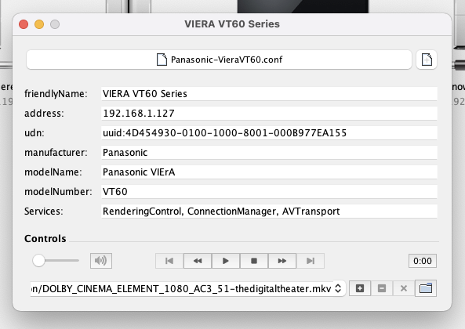

# How to play media

This article will explain the 4 main ways to play video, audio and images via UMS.

## 1: Play from a renderer interface

When your renderer is connected to UMS via DLNA/UPnP, often it will display in a menu called "Media Servers" or something similar, depending on the renderer. From there, you can enter UMS and browse to the media you want to access.

The implementation of this varies greatly per renderer, but the core functionality is the same; navigate to your chosen media and select it to play.

## 2: Push from the UMS interface to a renderer

The UMS interface itself has the ability to "push" media to renderers if they support the UPnP feature. It is a similar concept to casting.

1. Open the UMS UI and identify the renderer you want to push media to. In this case it is the Panasonic VIERA VT60 Series TV.  

2. Click on the renderer image to open the control panel  

3. Choose the file you want to push by clicking the folder icon on the lower right, and it will be filled in on the lower left.
If you do not see the player controls in this window, your renderer does not support this functionality. Be sure to check for firmware/software updates to your renderer as they may have added support for it  

4. Now you can either create a playlist by clicking the plus icon to the immediate right of the input box, or you can push the file to your renderer by clicking the play icon just above the middle of the input box, which will start it playing on your renderer.

## 3: Play on the web interface

The web interface can be accessed anywhere within your local network, including on computers and renderers. In many ways it offers our most advanced UI and features.

1. Open the web interface. If you know the address you can go to that, otherwise an easy way is to click the Web interface button on our UI  

2. Clicking that will open the web interface in your default browser. From there you can navigate to your file and click to play it  

## 4: Push from the web interface to a renderer

Similar to above in option 2, you can push your media to a renderer via our web interface.

1. Clicking the little cast icon for a file when browsing a directory. It is on the lower right of the thumbnail.  

2. That will make a mini floating control panel appear, which you can use to control playback of the file, and manage dynamic playlists if you choose.  

